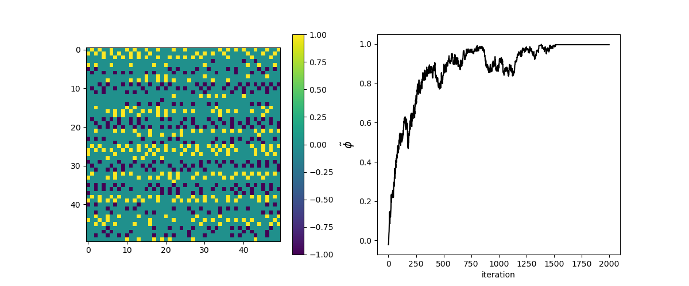

# Pedestrian Counterflow: Investigating Lane formation through Cellular Automata dynamics



## Table of Contents

* [Introduction](#introduction)
* [Project Structure](#project-structure)
* [Installation](#installation)
* [Instructions CLI](#instructions-command-line-interface)

## Introduction

This project is part of the Complex System Simulation course at the UvA. A 2D Cellular Automata system is used to simulate a corridor containing two crowds of people, moving in opposite ways. The goal is to investigate the emergent phenomenon of lane formation and it's dependance on several parameters. 

## Project Structure

```
.
├── bash_scripts/           # DATA GENERATION
│   └── ...
│
├── classes/              # CLASSES
│   ├── __init__.py     # Initialisation
│   ├── cell.py         # Handling cells in the lattice
│   ├── lattice.py         # Handling the lattice itself
│   └── simulation.py       # Handling the simulation
│
├── results/                   # RESULTS
│   ├── data                # Averages over multiple runs
│   ├── final_snapshots        # Image of the final iteration of every run
│   └── raw_data            # Each individual run 
│   
├── helpers.py              # Helper functions
├── main.py                 # Handles CLI use (see below)
├── data_analysis.ipynb              # Handling analysis of the data
├── Analysis2.ipynb                # Handling analysis of the data
│
├── LICENSE
├── README.md
└── requirements.txt
```

## Installation

1. Clone the repository:
```bash
git clone https://github.com/Ninavd/crowd-control.git
```
2. Change directory to the cloned repository.
3. Install the required dependencies:
```bash
pip install -r requirements.txt
```

## Instructions Command-Line Interface

Simulations may be run using the command-line using `python3 main.py [args]`. The following arguments may be specified:

```bash
python3 main.py [-h] [-n RUNS] [-s SIZE] [-p P] [-v] [--save_video] [--save_results] density iterations
```

```
Simulate lane formation in heterogenic crowds

positional arguments:
  density               density of the crowd on the lattice
  iterations            number of timesteps executed per run

options:
  -h, --help            show this help message and exit
  -n RUNS, --runs RUNS  number of runs
  -s SIZE, --size SIZE  size of the L x L lattice
  -p P                  likeliness of trying to move straight forward
  -v, --animate         visualize the simulation while running
  --save_video          save simulation visuals to mp4
  --save_results        store all data in a csv for each simulation/run
```

## Contributors 
The following students collaborated on this project:
- Joanna Costa e Silva ([@Joana-CSilva29](https://github.com/Joana-CSilva29))
- Guido Hanegraaf ([@guidohanegraaf1](https://github.com/guidohanegraaf1))
- Nina van der Meulen ([@Ninavd](https://github.com/Ninavd))
- Kevin Schaaf ([@Ksf900](https://github.com/Ksf900))

