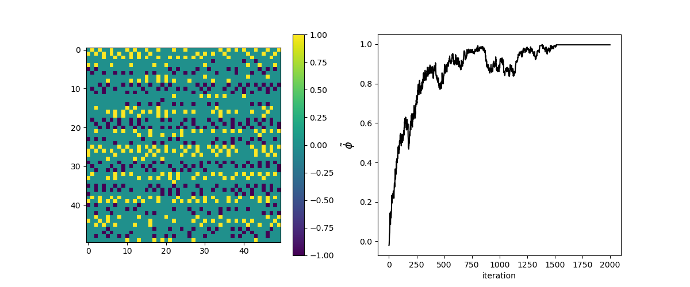

# Pedestrian Counterflow: Investigating Lane formation through Cellular Automata dynamics



## Contributors 
The following students collaborated on this project:
- Joanna Costa e Silva ([@Joana-CSilva29](https://github.com/Joana-CSilva29))
- Guido Hanegraaf ([@guidohanegraaf1](https://github.com/guidohanegraaf1))
- Nina van der Meulen ([@Ninavd](https://github.com/Ninavd))
- Kevin Schaaf ([@Ksf900](https://github.com/Ksf900))

## Table of Contents

* [Introduction](#introduction)
* [Project Structure](#project-structure)
* [Installation](#installation)
* [Instructions CLI](#instructions-command-line-interface)
* [Licensing](#license)

## Introduction

This project is part of the 2024 Complex System Simulation course at the UvA. A 2D Cellular Automata system is used to simulate a corridor containing two crowds of people, trying to reach the opposite side of an infinite corridor. The goal is to investigate the emergent phenomenon of lane formation and its dependance on several parameters. Simulations can be visualized in real time or saved to mp4 and csv files. Documentation of this module, generated with pydoc, can be found [here](https://ninavd.github.io/crowd-control/).

## Project Structure

```
.
├── bash_scripts/           # DATA GENERATION
│   └── ...
│
├── classes/              # CLASSES
│   ├── __init__.py     
│   ├── cell.py            # Class representing cells in the lattice
│   ├── lattice.py         # Class representing the lattice itself
│   └── simulation.py      # Class handling the simulation
│
├── results/                 # RESULTS
│   ├── data/                # Averages over multiple runs
│   ├── final_snapshots/     # Images of the final iteration for every run
│   └── raw_data/            # Save files of each individual run 
│   
├── helpers.py              # Helper functions
├── main.py                 # Handles CLI use (see below)
├── data_analysis.ipynb     # Contains analysis and plots of the data
├── LICENSE
├── README.md
└── requirements.txt
```

## Installation

1. Clone the repository:
```bash
git clone https://github.com/Ninavd/crowd-control.git
```
2. Change directory to the cloned repository.
3. Install the required dependencies:
```bash
pip install -r requirements.txt
```
4. Create a simulation_videos dir if you wish to save videos
```bash
mkdir simulation_videos
```
5. Install ffmpeg
```bash
sudo apt-get install ffmpeg
```

## Instructions Command-Line Interface

Simulations may be run using the command-line using `python3 main.py [args]`. The following arguments may be specified:

```bash
python3 main.py [-h] [-n RUNS] [-s SIZE] [-p P] [-v] [--save_video] [--save_results] density iterations
```

```
Simulate lane formation in heterogenic crowds

positional arguments:
  density               density of the crowd on the lattice
  iterations            number of timesteps executed per run

options:
  -h, --help            show this help message and exit
  -n RUNS, --runs RUNS  number of runs (default = 1)
  -s SIZE, --size SIZE  size of the L x L lattice (default = 50)
  -p P                  likeliness of trying to move straight forward (default = 1)
  -v, --animate         visualize the simulation while running (default = False)
  --save_video          save simulation visuals to mp4 (default = False)
  --save_results        store all data in a csv for each simulation/run (default = False)
```
**Example Usage**

The following command runs one simulation with 200 iterations on a 50x50 lattice with a crowd density of 0.18, visualizing the simulation in real time, saving a video to mp4 after completion in the `simulation_videos/` folder.
```bash
python3 main.py 0.18 200 -v --save_video
```

## Licensing
This project is licensed under the [MIT License](LICENSE.md) - see the [LICENSE.md](LICENSE.md) file for details.
